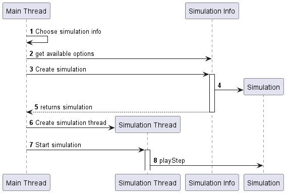

# Runtime Information

Each simulation consists of two main classes. The first implementing SimulationInfo, holds the information *about* the simulation (such as how many players it supports or any setup options). The second implements Simulation holds the game logic itself.

