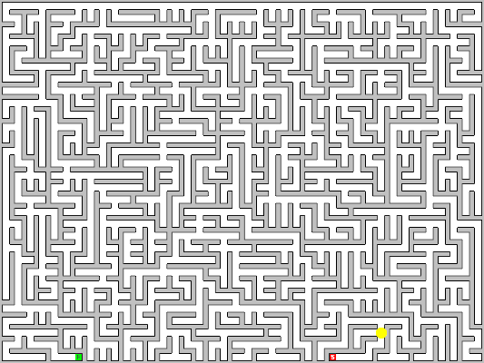
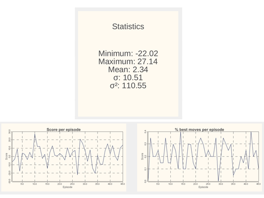
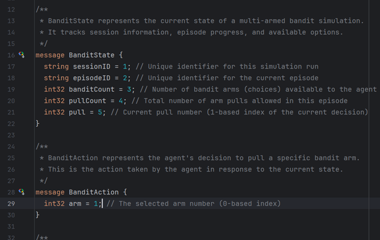

# Learning AI shouldn't start with learning a new language.

  

          

              <button type="button" data-bs-target="#carouselExampleCaptions" data-bs-slide-to="0" class="active" aria-current="true" aria-label="Slide 1"></button>
              <button type="button" data-bs-target="#carouselExampleCaptions" data-bs-slide-to="1" aria-label="Slide 2"></button>
              <button type="button" data-bs-target="#carouselExampleCaptions" data-bs-slide-to="2" aria-label="Slide 3"></button>
          

          

              

                  
                  

                      <h5>Program AI agents to explore games</h5>
                      
Some representative placeholder content for the first slide.

                  

              

              

                  
                  

                      <h5>Track your success</h5>
                      
Some representative placeholder content for the second slide.

                  

              

              

                  
                  

                      <h5>Use REST with JSON or XML</h5>
                      
Some representative placeholder content for the third slide.

                  

              

          

          <button class="carousel-control-prev" type="button" data-bs-target="#carouselExampleCaptions" data-bs-slide="prev">
              
              Previous
          </button>
          <button class="carousel-control-next" type="button" data-bs-target="#carouselExampleCaptions" data-bs-slide="next">
              
              Next
          </button>
      

Use your existing programming skills to train an AI in one of our environments.

We provide ProtoBuff based interfaces that can be used by any modern programming language. This way you can leverage
your existing coding expertise and don’t waste time on anything else. We provide hints and safe spaces for your baby AI
to learn and grow.

Use your existing programming skills to train an AI in one of our environments.

We provide REST based interfaces that can be used by any modern programming language. This way you can leverage your
existing coding expertise and don’t waste time on anything else. We provide hints and safe spaces for your baby AI to
learn and grow.

## Download

Download the sandbox and start coding straight away.

## Environments

Look at the environments you can code against.

## Learn to code AI

Learn the Q-Learning algorithm and start solving problems.

