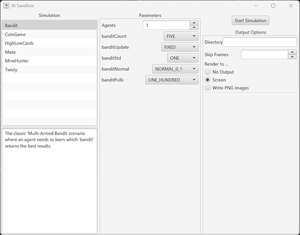

# Getting Started

The AI Sandbox server can be run on Windows, Mac or Linux desktops and allows you to experiment with
reinforcement learning and other artificial intelligence scenarios.
The server exposes interfaces that applications in any language (that support the protobuf protocol)
can connect to and interact with. To see a worked example, see the demos on GitHub:

- Examples in [Java](https://github.com/graham-evans/AISandbox-Demos-Java)
- Examples in [Python](https://github.com/graham-evans/AISandbox-Demos-Python)

To get Started follow these steps:

## Step 1 - download and run the client.

The server is available from the [download page](Downloads.md) in three formats:

- A platform specific installer (Windows & Linux) that includes a Java runtime environment.
- Platform specific application files (Windows, Mac & Linux), which rely on an existing Java
  environment (version 21 or higher).
- Source code which can be [compiled](../dev/Compiling.md) and run on any platform.

## Step 2 - Configure and run a simulation.

Running the application shows you a configuration screen showing the options available:

- The left column shows the simulations available together with a brief description.
- The middle column shows simulation specific options, these are explained on
  the [simulation pages](../simulations/index.md).
- The right column shows runtime settings such as output and networking options.

Configure the simulation and press "start Simulation" to start.

## Step 3 - Write an agent to explore the simulation.

When running, the simulation will open a network port for each of the agents in use. You can use any
programming language that supports the [Protobuf](https://protobuf.dev/) protocol to connect to this
port and communicate with the server.

Examples are included in the following GitHub repositories:

- Examples in [Java](https://github.com/graham-evans/AISandbox-Demos-Java)
- Examples in [Python](https://github.com/graham-evans/AISandbox-Demos-Python)
