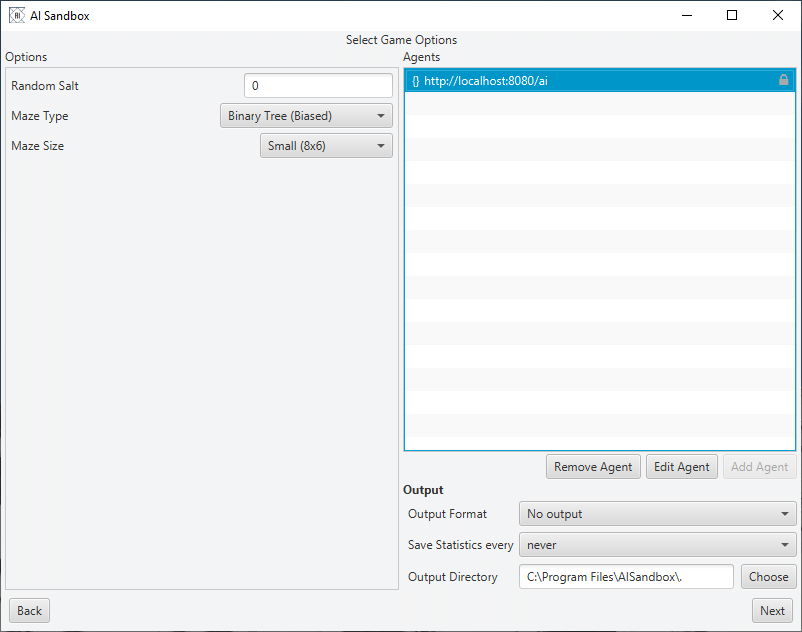
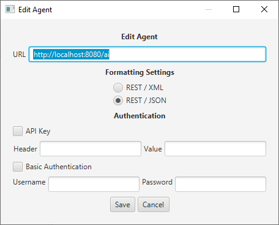
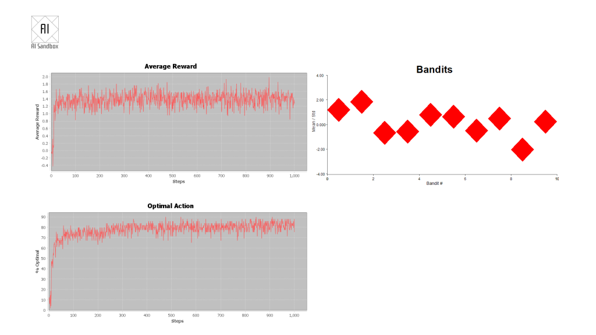
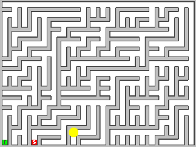
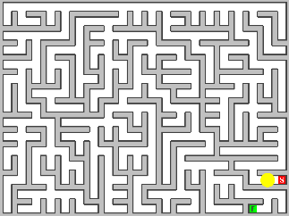
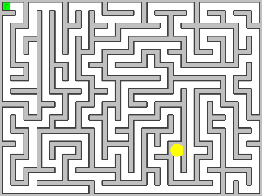
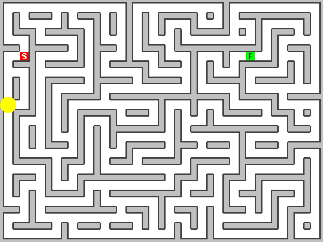
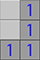

# Legacy code - version 1.2.1

The original AI Sandbox featured a REST based protocol and a "client" application. The
sandbox app called out to a REST server API (which you developed), this made it easy for developers
who were used to server-side programming and Swagger specifications, to start their AI journey.

Although development has moved to a new code base, the original downloads are
still [available](../intro/Downloads.md).

The following documentation is taken from the original website:

## Getting Started

### Step 1 - download and run the client.

The easiest way to run the client is to download a platform-specific installer for Windows, Linux or
Mac. Installing this way will add the application to your start menu and / or create a desktop
launcher.

Alternatively, if you have a recent (version 11 or later) Java Runtime Environment installed, you
can download the cross-platform JAR and launch the application with the command:

```java -jar AISandbox-Client-version.jar```

where version matches the version number you downloaded.

Note: due to the architecture restrictions of JavaFX, the JAR file will only run on Windows, Linux
and Mac.

### Step 2 - setup the simulation

After choosing a simulation to run, you will be shown a screen similar to this:



On the left hand side are options to tailor the simulation. This will be different for each
scenario. The top right is where you configure your agents. Each agent is defined as a URL which the
client will connect to.

Add an agent by pressing the add agent button then configure it by double-clicking on the URL.



On the edit agent screen, you can change the agent endpoint as well as add authentication and choose
between REST-JSON and REST-XML.

Returning to the main screen, the bottom right of the window will allow you to set up any output
options. This includes the ability to take screenshots for any frame or export the output of the
simulation as a video.

### Step 3 Run Simulation

Clicking on ‘next’ will take you to the run screen

Pressing start will initialise the simulation, the output of which is shown in the main viewscreen.

The graphs at the bottom will summarise how your agent is running.

# Scenarios

## Multi-Armed Bandits

The Multi-Armed Bandit is one of the classic problems studied in probability theory and AI and it’s
one of the first problems you are likely to look at when doing a Reinforcement Learning class. The
basic premise is that you have a row of one-armed bandit machines, each tuned to pay out a reward
based on a different random variable. When playing you have to decide between choosing to play with
the bandit that you think will give you the highest reward, and playing with another bandit which
will allow you to build up a more accurate picture of the rewards available.

This trade-off between exploration and exploitation can be seen in many real-world scenarios and
research on advanced versions of the Multi-Armed Bandit problem is still ongoing nearly seventy
years after the problem was first explored.

For more background information see
the [Wikipedia Article](https://en.wikipedia.org/wiki/Multi-armed_bandit).

### Goal

Write an AI that learns then selects the bandit which returns the highest reward.

### Algorithms and Hints

- Create an AI that either picks a random bandit, or chooses the bandit that has returned the
  highest average reward. Select which of the two strategies to use for each pull based randomly (
  based on a percentage). This is known as the e-greedy algorithm.
- Alter the algorithm so that all the random pulls are taken first.

### Setup

At the start of each round, each bandit is assigned a different random variable with a normal
distribution N(μ,σ²).

The following options are available when setting up the scenario:

| Parameter                 | Description                                                                                                                                                                         |
|---------------------------|-------------------------------------------------------------------------------------------------------------------------------------------------------------------------------------|
| # Bandits                 | The number of bandits available, numbered 0…n-1.                                                                                                                                    |
| # Pulls                   | The number of arm-pulls in each round.                                                                                                                                              |
| Bandit Mean               | How the mean of each bandit is chosen                                                                                                                                               |
| Bandit Standard Deviation | How the standard deviation of each bandit is chosen                                                                                                                                 |
| Update Rule               | How the mean of each bandit is updated after each step                                                                                                                              |
| Random Salt               | A repeatable salt for the random number generator – use ‘0’ to create a new value each time                                                                                         |
| Skip intermediate frames  | If checked the screen (and output) will only be updated at the end of each round, rather than after every pull. This dramatically reduces the amount of time spend updating the UI. |

### API Interface

The Swagger specification for this API can be
downloaded [here](https://files.aisandbox.dev/swagger/bandit.yaml).

In each step the Sandbox Client will send the following to the AI server:

- history – the result of the last step (except for the first step of the first round), this
  consists of:
    - sessionID – the session identifier for the previous step
    - chosenBandit – the index of the bandit selected by the AI
    - reward – the reward from the chosen bandit.
- sessionID – a session identifier, this will stay constant for the entire round.
- banditCount – the number of bandits available (numbered 0..n-1)
- pullCount – the number of times the bandits arm can be pulled in a round
- pull – the number of pulls already made this round

Note: If the number of pulls in a round is 100, then the pull parameter will range from 0 to 99.

### JSON Example Request

```JSON
{
  "history": {
    "sessionID": "DEF-5435",
    "chosenBandit": 4,
    "reward": 1.42
  },
  "sessionID": "ABC-23542342",
  "banditCount": 10,
  "pullCount": 10000,
  "pull": 0
}
```

### JSON Example Response

```json
{
  "arm": 3
}
```

### XML Example Request

```xml
<?xml version="1.0" encoding="UTF-8"?>
<BanditRequest>
  <history>
    <sessionID>DEF-5435</sessionID>
    <chosenBandit>4</chosenBandit>
    <reward>1.42</reward>
  </history>
  <sessionID>ABC-23542342</sessionID>
  <banditCount>10</banditCount>
  <pullCount>10000</pullCount>
  <pull>0</pull>
</BanditRequest>
```

### XML Example Response

```xml
<?xml version="1.0" encoding="UTF-8"?>
<BanditResponse>
  <arm>3</arm>
</BanditResponse>
```

### Graphical Output



The graphical output shows three charts:

Average reward – the reward from each step of the round, averaged over all rounds.

Optimal action – the average percentage that the AI picks the best bandit (the bandit with the
highest mean value) at each step in the round.

The current mean (centre of each diamond) and standard deviation (top and bottom of each diamond) of
each of the bandits.

### Statistics Output

The statistics file will show the average reward and the amount of times each step has chosen the
best answer, averaged over all rounds.

| Step | Ave Reward           | % Optimal Action  |
|------|----------------------|-------------------|
| 0    | 0.11180486767982283  | 8.0               |
| 1    | -0.16001485097160476 | 6.000000000000003 |
| 2    | 0.01309801032724169  | 6.000000000000001 |

## Mazes

The Maze scenario places the AI agent inside a randomly generated maze. The agent can move about the
maze, bumping into walls and exploring the paths, until it finds the finish square. Once at the
finish square, the agent is returned to the beginning to repeat the process. The goal is to explore
the maze and find the shortest path from start to finish. Unlike in a physical maze the start and
finish are not always placed at the edges.

Mazes can be generated in several different styles and sizes.

**Binary Tree**



A binary tree maze is the simplest of the mazes implemented but contains a heavy diagonal bias.

**Sidewinder**



While still biased (the top row will always be a single run of open squares) this looks more like a
typical maze than the Binary Tree.

**Recursive Backtracker**



This is the maze that most people will recognise, it has many long twisting passages which makes for
long solutions.

**Braided**



The braided maze is similar to the recursive backtracker, but with all dead-ends removed. Because of
this the maze may feature loops and open areas. This can create challenges for some AIs as there may
be multiple routes to the same point.

### Algorithms and Hints

- This scenario is designed to be used as an introduction into Q-Learning, and the small mazes can
  be solved and optimised very quickly.
- Because the maze is discrete and unchanging you could also use a search algorithm (such as depth
  first) to explore and find the quickest route.

### Further Challenges

- Two of the algorithms create biased mazes (Binary Tree and Sidewinder) can you use knowledge of
  this bias to speed your solver up?
- On mazes generated by the sidewinder algorithm, the start position is usually on the bottom row
  and the AI can easily navigate to the top row. This effectively bisects the maze, given that the
  finish position is placed as far as possible from the start, can you use this information to
  prioritise the search?
- Can you navigate the maze without memorising where you have been?

### API Interface

The Swagger specification for this API can be downloaded (
here)[https://files.aisandbox.dev/swagger/maze.yaml].

The API is implemented as a single POST action which contains:

- The configuration of the board, consisting of:
    - Board ID – this is unique to the maze that is being played.
    - Valid Moves – the possible directions to move in, normally “North”, “South”, ”East” and
      “West”.
    - Width – the width of the board
    - Height – the height of the board
- (Optional) The result of the last move
    - The previous position
    - The action that was taken
    - A numerical reward (hitting a wall=-1000, taking a step=-1, finding the exit=+1000) for the
      last action.
    - The resulting position.
- The current position

The result is always a move command followed by one of the valid directions.

Notes:

1. Positions are represented in X, Y coordinates with (0,0) at the top left.
2. Agents are automatically reset to the start position after finding the exit. Because of this the

### JSON Example Request

```json
{
  "config": {
    "boardID": "2e2e83e5-9ca4-48f3-a6b4-ba1e0061fdfa",
    "validMoves": [
      [
        "North",
        "South",
        "East",
        "West"
      ]
    ],
    "width": 10,
    "height": 20
  },
  "history": {
    "lastPosition": {
      "x": 3,
      "y": 4
    },
    "action": "East",
    "reward": -10.5,
    "newPosition": {
      "x": 3,
      "y": 4
    }
  },
  "currentPosition": {
    "x": 3,
    "y": 4
  }
}
```

### JSON Example Response

```json
{
  "move": "North"
}
```

### XML Example Request

```xml
<?xml version="1.0" encoding="UTF-8"?>
<MazeRequest>
  <config>
    <boardID>2e2e83e5-9ca4-48f3-a6b4-ba1e0061fdfa</boardID>
    <validMoves>
      <0>North
    </0>
  </validMoves>
  <width>10</width>
  <height>20</height>
</config>
<history>
<lastPosition>
  <x>3</x>
  <y>4</y>
</lastPosition>
<action>East</action>
<reward>-10.5</reward>
<newPosition>
  <x>3</x>
  <y>4</y>
</newPosition>
</history>
<currentPosition>
<x>3</x>
<y>4</y>
</currentPosition>
  </MazeRequest>
```

### XML Example Response

```xml
<?xml version="1.0" encoding="UTF-8"?>
<MazeResponse>
  <move>North</move>
</MazeResponse>
```

## Mine Hunter

Mine Hunter pits the AI against a minefield! A known quantity of mines has been distributed across a
grid of squares and the AI agent must work out where they are. To help, each uncovered square will
show how many mines are in the surrounding squares.

The grid is represented as an array of characters:

| Character | Description                                    |
|-----------|------------------------------------------------|
| F         | A flagged mine                                 |
| f         | An incorrectly flagged empty space (game over) |
| #         | A covered square                               |
| X         | An exploded mine (game over)                   |
| .         | An uncovered square with no neighbouring mines |
| 1-8       | An uncovered square with n neighbouring mines  |

and organised in a two-dimensional array (with 0,0 at the top left).

### Example Board



JSON Representation

```json
"board": [
"#1",
"#1",
"11"
]
```

XML Representation

```xml

<board>#1</board>
<board>#1</board>
<board>11</board>
```

Note: in this example the correct response would be to place a flag at 0,1.

### Goal

Write an AI agent that can solve as many boards as possible, this can be measured by a moving
average which is shown on the output.

### Algorithms and Hints

There are quite a few algorithms that can be used to solve this scenario:

- Rules based solutions – These rely on recognising predefined (hand coded) patterns that occur in
  most games examples of these can be found on
  the [minesweeper wiki](http://www.minesweeper.info/wiki/Strategy).
- Constraints based solutions – A board can be considered as a series of constraint based problems,
  with each square being a mine (value 1) or not (value 0). Each numbered square is a constraint
  which needs to be met for a solution to be valid.
- Monti Carlo simulations – Rather than trying to deduce where the mines are, you may like to try to
  generate lots of random boards based on the number of remaining undiscovered mines. Filtering
  these solutions if they don’t match the available knowledge. Then estimating the probability of
  each
  uncovered square being a mine.
- Guessing – If all else fails, don’t be afraid to just guess!

### API Interface

The Swagger specification for this API can be
downloaded [here](https://files.aisandbox.dev/swagger/mine.yaml).

In each step, the Sandbox Client will send the following information to the AI server:

- (Optional) the result of the last step, this consists of:
    - The boardID (unique identifyer) of the board being played.
    - The result at the end of the last move, either “PLAYING”, “WON”, “LOST”. If the result is
      PLAYING that means the previous moves were successful, but there are still uncovered or
      unflaged squares remaining. The new board will be a continuation of the last game. If the
      result is “WON” or “LOST” then a new board will have been generated.
- The boardID of the current board.
- The board represented as a series of character strings (see example above).
- The number of flags still to be placed.

The AI agent should respond with one or more moves, each move consists of:

- The location (x,y) of the move, with (0,0) being the top left square.
- Should this move place a flag (flag=true) or uncover a square (flag=false).

Note: there is no limit to the number of moves that can be included in each response. However, if a
move results in the game ending, subsequent guesses will be ignored rather than carried over to the
next game.

### JSON Example Request
```json
{
"lastMove": {
"boardID": "1233-5678-90abc-2435",
"result": "LOST"
},
"boardID": "1234-1234-1234-1234",
"board": [
"##1..",
"##1..",
"221..",
"#1..."
],
"flagsRemaining": 3
}
```

### JSON Example Response

```json
{
"moves": [
{
"x": 1,
"y": 1,
"flag": true
}
]
}
```

### XML Example Request

```xml
<?xml version="1.0" encoding="UTF-8"?>
<MineRequest>
   <lastMove>
      <boardID>1233-5678-90abc</boardID>
      <result>LOST</result>
   </lastMove>
   <boardID>1234-1234-1234-1234</boardID>
   <board>##1..</board>
   <board>##1..</board>
   <board>221..</board>
   <board>#1...</board>
   <flagsRemaining>3</flagsRemaining>
</MineRequest>
```

### XML Example Response

```xml
<?xml version="1.0" encoding="UTF-8"?>
<MineResponse>
    <moves>
        <x>1</x>
        <y>1</y>
        <flag>true</flag>
    </moves>
</MineResponse>
```