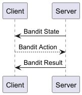
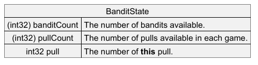

# Multi-Armed Bandits

The Multi-Armed Bandit is one of the classic problems studied in probability theory and AI and it’s one of the first problems you are likely to look at when doing a Reinforcement Learning class. The basic premise is that you have a row of one-armed bandit machines, each tuned to pay out a reward based on a different random variable. When playing you have to decide between choosing to play with the bandit that you think will give you the highest reward, and playing with another bandit which will allow you to build up a more accurate picture of the rewards available.

This trade-off between exploration and exploitation can be seen in many real-world scenarios and research on advanced versions of the Multi-Armed Bandit problem is still ongoing nearly seventy years after the problem was first explored.

For more background information see the [Wikipedia Article - Mulri-armed Bandit](https://en.wikipedia.org/wiki/Multi-armed_bandit).

# Goal

Write an AI that learns then selects the bandit which returns the highest reward.

# Algorithms and Hints

Create an AI that either picks a random bandit, or chooses the bandit that has returned the highest average reward. Select which of the two strategies to use for each pull based randomly (based on a percentage). This is known as the e-greedy algorithm.
Alter the algorithm so that all the random pulls are taken first.

# Setup

At the start of each round, each bandit is assigned a different random variable with a normal distribution N(μ,σ²).

The following options are available when setting up the scenario:

| Key                                                                                                     | Value                                            |
|---------------------------------------------------------------------------------------------------------|--------------------------------------------------|
| # Bandits	                                                                                              | The number of bandits available, numbered 0…n-1. |
| # Pulls                                                                                                 | 	The number of arm-pulls in each round.          |
| Bandit Mean                                                                                             | How the mean of each bandit is chosen |
| Bandit Standard Deviation | How the standard deviation of each bandit is chosen |                           
| Update Rule | How the mean of each bandit is updated after each step |                                      

# Protocol

The protocol is detailed in [Bandit.proto](../../../src/main/proto/Bandit.proto). And follows a standard State -> Action -> Reward pattern.

## Bandit State

The state is sent to the client first, with the

