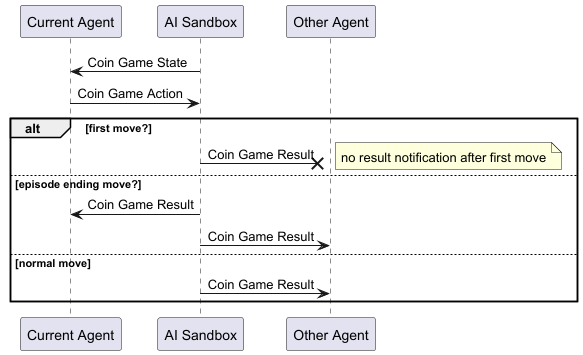

# The Coin Game

The Coin Game is a scenario for two agents and used to introduce rule based AI in Mark Liu's "
AlphaGo Simplified" book (although many other techniques can be used). Several varients are
available with perhaps the most famous one mirroring the classic
game [Nim](https://en.wikipedia.org/wiki/Nim).

Agents take turns removing coins from rows (or piles) labeled 0...(n-1). Depending on the scenario,
the number of coins in each row can be different, and so to is the maximum number of coins that can
be removed; but all coins must always be taken from the same row. The winner is the agent who forces
the other to remove the last coin.

# Goal

Write two AI's that can play against each other, then learn how to counter each other's tactics.

Note: These scenarios can be 'solved' so for each scenario there is a perfect strategy where the
winner can be determined by which agent goes first.

# Algorithms and Hints

Start with two random agents, then limit their options to only take valid moves. You could now
investigate either a Q-Learning strategy, or a rules based strategy to discover the perfect play.

# Setup

There are several variations of this scenario that can be chosen at startup:

| Scenario Name | Coin layout                                                                | Max Coins taken |
|---------------|----------------------------------------------------------------------------|-----------------|
| SINGLE_21_2   | Single row of 21 coins                                                     | 2               |
| SINGLE_21_3   | Single row of 21 coins                                                     | 3               |
| DOUBLE_21_2   | Two rows of 21 coins                                                       | 2               |
| DOUBLE_21_3   | Two rows of 21 coins                                                       | 3               |
| NIM           | Row 0 = 1 coin Row 1 = 3 coins Row 2 = 5 coins Row 3 = 7 coins | 2               |

# Protocol

The protocol is defined
in [CoinGame.proto](https://github.com/graham-evans/AISandbox-Server/blob/main/src/main/proto/CoinGame.proto);
while it follows the standard State -> Action -> Reward pattern, the reward is dependent not only on
the agents move, but also the result of the other agents move.

## CoinGameState

| Component | Data Type      | Description                                                               |
|-----------|----------------|---------------------------------------------------------------------------|
| sessionID | string         | Unique identifier for this simulation run                                 |
| episodeID | string         | Unique identifier for the current episode                                 |
| rowCount  | int32          | The number of rows on the game board                                      |
| coinCount | repeated int32 | The number of coins in each row (array length equals rowCount)            |
| maxPick   | int32          | The maximum number of coins that can be taken from a row in a single turn |

## CoinGameAction

| Component   | Data Type | Description                                                             |
|-------------|-----------|-------------------------------------------------------------------------|
| selectedRow | int32     | The row from which to remove coins (0-based index)                      |
| removeCount | int32     | The number of coins to remove from the selected row (must be ≤ maxPick) |

## CoinGameResult

| Component | Data Type      | Description                                                                |                                                                
|-----------|----------------|----------------------------------------------------------------------------|
| status    | CoinGameSignal | Continue the game or register a win or loss. \[ WIN \| PLAY \| LOSE \] |