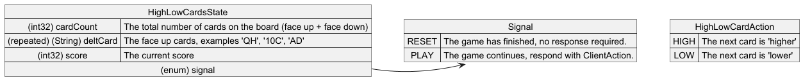

# High Low Cards

The 'High Low' card game involves predicting whether the next card draw from a pack will be higher or lower than the one before. 

## Overview
This simulation tests an AI's ability to predict the next card to be tuned over.

## Protocol
The protocol is defined in [HighLowCards.proto](../../../src/main/proto/HighLowCards.proto), and consists of three objects.

