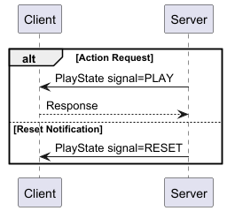

# High Low Cards

The 'High Low' card game involves predicting whether the next card draw from a pack will be higher
or lower than the one before. Agents are prompted with the current board, including already observed
cards and predict 'HIGHER' or 'LOWER'. If the prediction is correct, the scenario continues until
all cards are guessed.

Note: If the next card is the same rank as the previous one, the result will always be a loss.
Because of this and agent will never be able to sustain a 100% success rate (over many episodes).

## Goal

Write an AI that successfully predicts whether the next card from the deck will be higher or lower
than the current visible card.

## Algorithms and Hints

A simple strategy is to predict "higher" when the current card is in the lower half of the deck's
range, and predict "lower" when the current card is in the upper half. However, more sophisticated
approaches that track the cards already seen can increase prediction accuracy as the game
progresses.

## Setup

Each round begins with a shuffled standard deck of 52 playing cards. Cards are ranked from lowest to
highest as follows: 2, 3, 4, 5, 6, 7, 8, 9, 10, J, Q, K, A. Suits are ignored for comparison
purposes.

There are no configurable parameters for this simulation.

## Protocol

The protocol is defined
in [HighLowCards.proto](https://github.com/graham-evans/AISandbox-Server/blob/main/src/main/proto/HighLowCards.proto),
and follows the traditional State -> Action -> Reward pattern.

## HighLowCards State

| Component | Data Type       | Description                                                    |
|-----------|-----------------|----------------------------------------------------------------|
| sessionID | string          | Unique identifier for this simulation run                      |
| episodeID | string          | Unique identifier for the current episode                      |
| cardCount | int32           | The total number of cards on the board (face up + face down)   |
| dealtCard | repeated string | The face up cards (the last record shows the most recent card) |
| score     | int32           | The current score for this episode                             |

## HighLowCards Action

| Component | Data Type     | Description                           |
|-----------|---------------|---------------------------------------|
| action    | HighLowChoice | The prediction: \[ HIGHER \| LOWER \] |

## HighLowCards Reward

| Component | Data Type | Description                                                                       |
|-----------|-----------|-----------------------------------------------------------------------------------|
| score     | int       | The score after the prediction (increased for correct prediction)                 |
| signal    | Signal    | Indication of whether to continue the episode or reset. [ CONTINUE \| RESET ] |