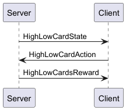

# High Low Cards
## Overview
This simulation tests an AI's ability to predict the next card to be tuned over.

## Protocol
The protocol is defined in [HighLowCards.proto](../../../src/main/proto/HighLowCards.proto), and cosists of two objects.

