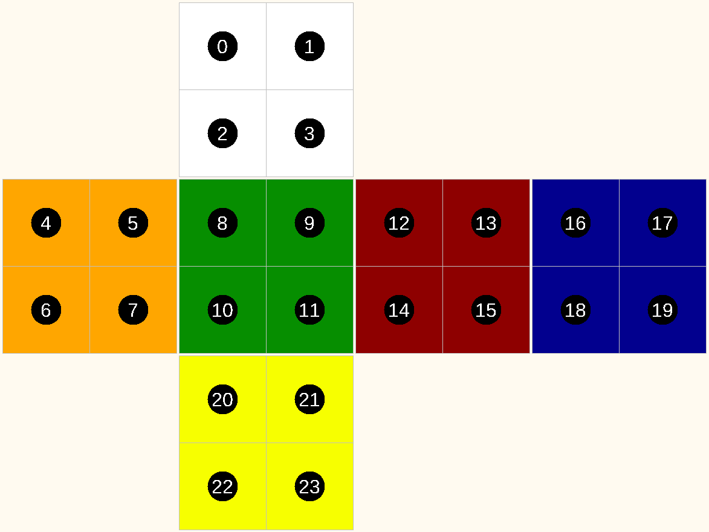
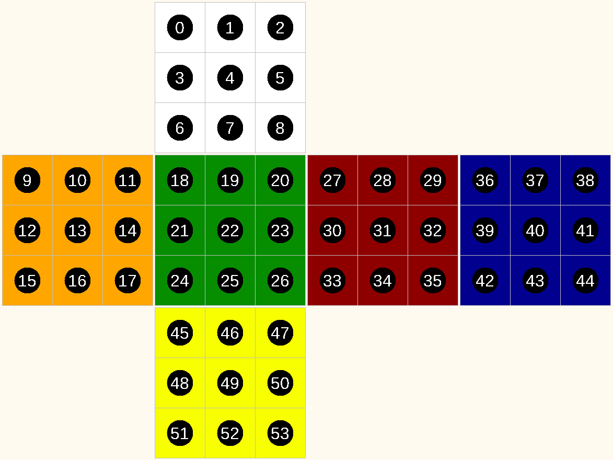
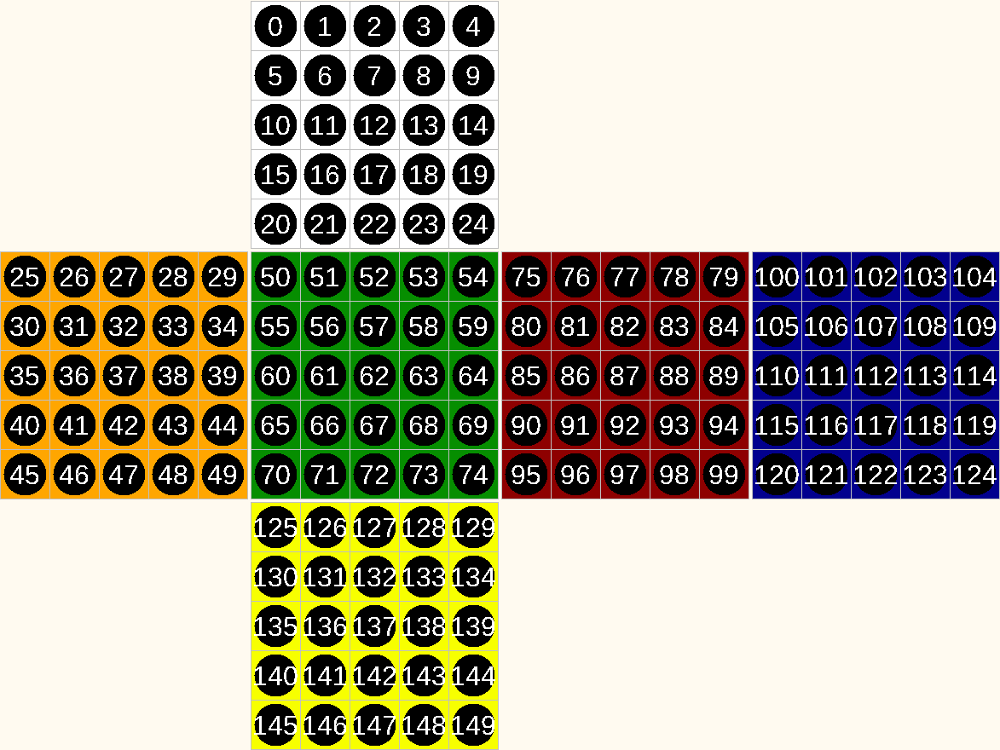
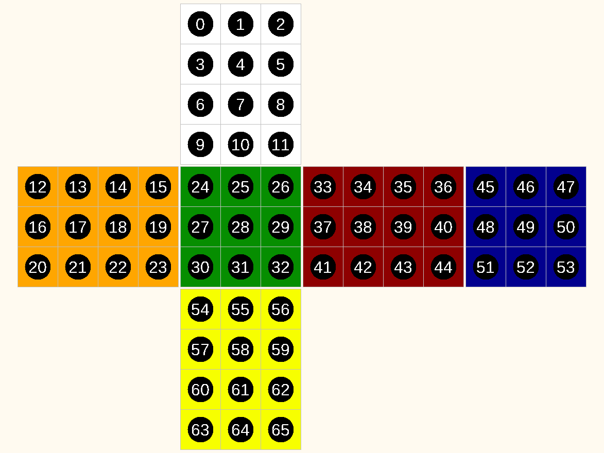

# Twisty Puzzles

Twisty Puzzles simulate various face movement puzzles like the Rubik's Cube and other cuboids. The
goal is to develop an agent capable of solving these puzzles by applying a series of rotations to
restore the puzzle to its solved state.

# Goal

Write an agent that can solve a puzzle, consistently using the least amount of moves.

# Algorithms and Hints

Agents should focus on:

1. Understanding the current puzzle state representation
2. Selecting optimal moves from the valid move list to solve the puzzle
3. Minimizing the number of moves to reach the solved state

Effective agents typically implement specialized algorithms for twisty puzzles, such as:

- Layer-by-layer methods
- CFOP (Cross, F2L, OLL, PLL) for Rubik's Cube
- Kociemba's algorithm
- Pattern recognition for specific puzzle states

# Setup

When setting up a Twisty simulation, the following parameters can be configured:

| Parameter   | Type       | Description                                                  |
|-------------|------------|--------------------------------------------------------------|
| puzzleType  | PuzzleType | The type of twisty puzzle to solve                           |
| startSolved | Boolean    | Whether the puzzle starts in a solved state (default: false) |

## Puzzle Types

The simulation supports the following types of puzzles:

| Puzzle Type | Description                        |
|-------------|------------------------------------|
| CUBE2       | 2x2x2 Pocket Cube                  |
| CUBE3       | 3x3x3 Rubik's Cube (standard)      |
| CUBE4       | 4x4x4 Rubik's Revenge              |
| CUBE5       | 5x5x5 Professor's Cube             |
| CUBE6       | 6x6x6 Cube                         |
| CUBE7       | 7x7x7 Cube                         |
| CUBE8       | 8x8x8 Cube                         |
| CUBE9       | 9x9x9 Cube                         |
| CUBE223     | 2x2x3 Cuboid                       |
| CUBE224     | 2x2x4 Cuboid                       |
| CUBE225     | 2x2x5 Cuboid                       |
| CUBE226     | 2x2x6 Cuboid                       |
| CUBE332     | 3x3x2 Cuboid (Floppy cube variant) |
| CUBE334     | 3x3x4 Cuboid                       |
| CUBE335     | 3x3x5 Cuboid                       |

All puzzles use
OBTM ([Outer Block Turn Metric](https://www.worldcubeassociation.org/regulations/#article-12-notation))
notation for move descriptions.

# Protocol

The agent communicates with the simulation using the following protocol messages
[link to proto](https://github.com/graham-evans/AISandbox-Server/blob/main/src/main/proto/Twisty.proto)

## TwistyState

Sent to the agent to represent the current state of the puzzle.

| Field      | Type            | Description                                                 |
|------------|-----------------|-------------------------------------------------------------|
| sessionID  | string          | Unique identifier for this simulation run                   |
| episodeID  | string          | Unique identifier for this episode                          |
| state      | string          | String representation of the current puzzle state           |
| steps      | int32           | Number of moves made so far in this episode                 |
| obtmMoves  | int32           | Number of OBTM moves so far in this episode                 |
| validMoves | repeated string | List of valid moves that can be made from the current state |

## TwistyAction

Sent by the agent to apply a move to the puzzle.

| Field | Type   | Description                                                         |
|-------|--------|---------------------------------------------------------------------|
| move  | string | The move notation (must be one of the valid moves from TwistyState) |

## TwistyResult

Sent to the agent after applying a move to the puzzle.

| Field  | Type         | Description                                                                                         |
|--------|--------------|-----------------------------------------------------------------------------------------------------|
| state  | string       | String representation of the puzzle state after the move                                            |
| signal | TwistySignal | Indication of whether the puzzle is solved, failed, or continuing \[ CONTINUE \| WIN \| LOSE \] |

# Cell order

The 'state' of the puzzle is represented as a string, with each character representing the current
colour of a face.

| Character | Colour |
|-----------|--------|
| W         | White  |
| O         | Orange |
| G         | Green  |
| R         | Red    |
| B         | Blue   |
| Y         | Yellow |

The order of the cells follows the same pattern regardless of the puzzle size, each face in turn (top, left, front, right, back, bottom) from top left to bottom right.

Examples:

Note: A puzzle is considered 'solved' when all faces are a single colour, the orientation of the
puzzle does not matter.