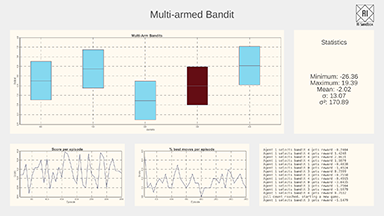
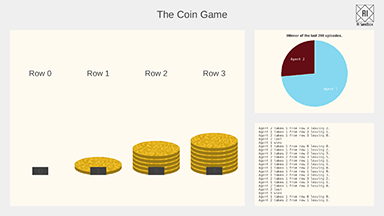
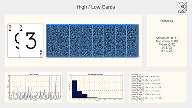

# Simulations

## [Multi Armed Bandits](Bandit/index.md)

Repeatedly select from a series of One-Armed Bandits, to achieve the best return over time.

## [The Coin Game](CoinGame/index.md)

A range of two player puzzles where the aim is to force your apponent to take the last coin.

## [High / Low Cards](HighLowCards/index.md)

Choose weather the next card will be 'Higher' or 'Lower' than the last.

## [Maze](Maze/index.md)

Explore a maze to find the exit then exploit the biases in the generator.

## [Mine Hunter](Mine/index.md)

Use logic to defuse a minefield.

## [Twisty Puzzles](Twisty/index.md)

Traditional logic puzzles of various sizes.