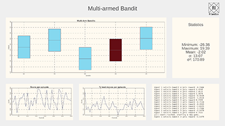
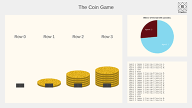
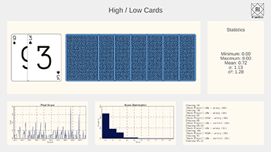
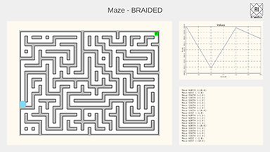
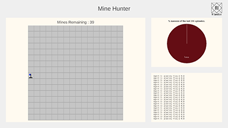
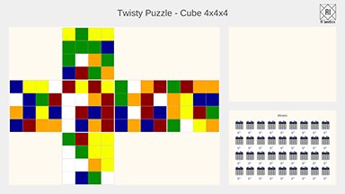

# Simulations

## [Multi Armed Bandits](Bandit/index.md)

##### [Dense Reward](../tags.md#dense-reward) [Random](../tags.md#random) [Single-Agent](../tags.md#single-agent)

Repeatedly select from a series of One-Armed Bandits, to achieve the best return over time.

## [The Coin Game](CoinGame/index.md)

##### [Competitive](../tags.md#competitive) [Deterministic](../tags.md#deterministic) [Multi-Agent](../tags.md#multi-agent) [Perfect Information](../tags.md#perfect-information) [Sparse Reward](../tags.md#sparse-reward)

A range of two player puzzles where the aim is to force your opponent to take the last coin.

## [High / Low Cards](HighLowCards/index.md)

##### [Dense Reward](../tags.md#dense-reward) [Partial Observation](../tags.md#partial-observation) [Random](../tags.md#random) [Single-Agent](../tags.md#single-agent)

Choose weather the next card will be 'Higher' or 'Lower' than the last.

## [Maze](Maze/index.md)

##### [Dense Reward](../tags.md#dense-reward) [Partial Observation](../tags.md#partial-observation) [Random](../tags.md#random) [Single-Agent](../tags.md#single-agent)

Explore a maze to find the exit then exploit the biases in the generator.

## [Mine Hunter](Mine/index.md)

##### [Partial Observation](../tags.md#partial-observation) [Random](../tags.md#random) [Single-Agent](../tags.md#single-agent) [Sparse Reward](../tags.md#sparse-reward)

Use logic to defuse a minefield.

## [Twisty Puzzles](Twisty/index.md)

##### [Perfect Information](../tags.md#perfect-information) [Random](../tags.md#random) [Single-Agent](../tags.md#single-agent) [Sparse Reward](../tags.md#sparse-reward)

Traditional logic puzzles of various sizes.

